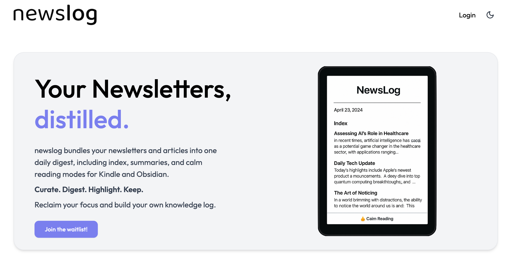
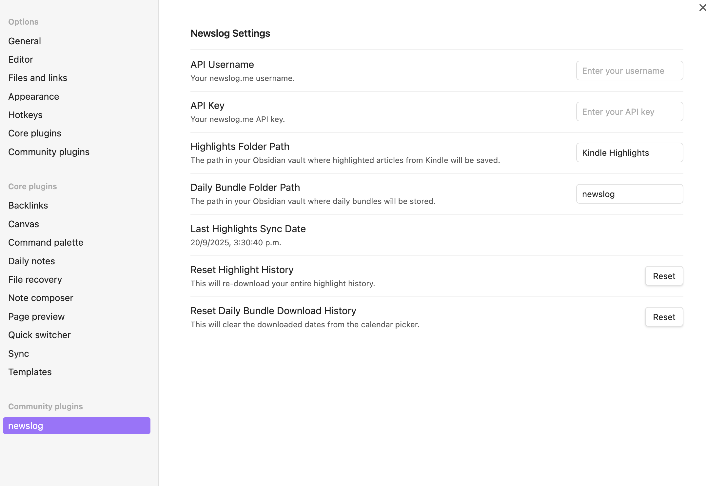
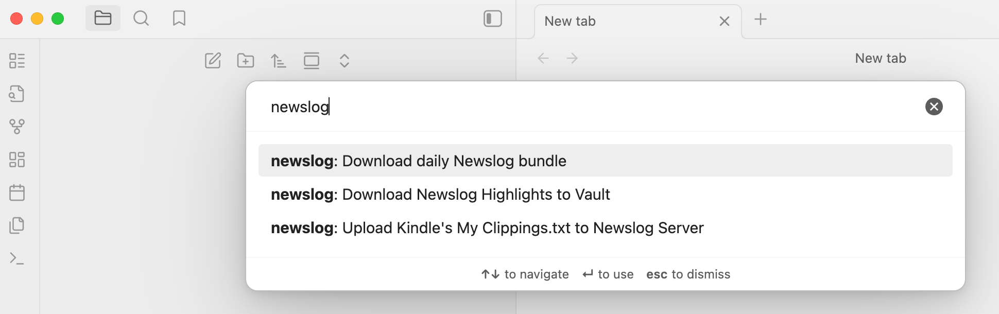

# newslog for Obsidian

[newslog](https://newslog.me) bundles your newsletters and articles into a single daily digest, complete with an index, AI-powered summaries, and calm reading modes for both Kindle and Obsidian.

With a personalized `@newslog.me` email address, you can subscribe to newsletters and send articles, keeping them out of your main inbox. Since email isn't always ideal for focused reading, newslog aims to provide a better experience.

## Features

- **Personalized Email Address**: Get a `@newslog.me` email to subscribe to newsletters or forward articles, keeping your primary inbox clean.
- **Daily Digest**: Receive a daily bundle of all your newsletters and articles from the previous day. It includes an AI-generated summary to help you decide what to read in-depth.
- **Kindle & Email Delivery**: Get your digest delivered to your Kindle (or preferred e-reader via email) for a focused and calm reading session.
- **Obsidian Integration**: Download your complete daily digests in Markdown format directly into your Obsidian vault.
- **Highlight Syncing**: Sync your Kindle highlights from newslog articles back to your Obsidian vault. The full article is saved in Markdown, with your highlights included, preserving context for your Personal Knowledge Management (PKM) system.

## Usage

1.  Install the official newslog plugin from within Obsidian's Community Plugins.
2.  Enable the plugin in your Obsidian settings.
3.  Configure the plugin settings:

    

    - **API Key** and **API Password**: Get this information from your account at newslog.me/settings.
    - **Highlights Folder Path**: The path in your Obsidian vault where highlighted articles from Kindle will be saved.
    - **Daily Bundle Folder Path**: The path in your Obsidian vault where daily bundles will be stored.
    - **Last Highlights Sync Date**: The last date you synced your Kindle highlights.
    - **Reset Highlight History** button allows you to re-download your entire highlight history.
    - **Reset Daily Bundle Download History**: When you download a daily bundle for a specific date, that date is marked as downloaded in the calendar picker. This button clears that history.

### Available commands

From the Obsidian command palette, you have the following commands available:

- **Download daily newslog Bundle**: Opens a calendar picker to select a date. Downloads the complete daily bundle of newsletters and articles for that date in Markdown format.
- **Upload Kindle's My Clippings.txt to newslog server**: Sync your highlights by uploading the `My Clippings.txt` file from your Kindle device. You can get this file by connecting your Kindle to your computer via USB. newslog processes this file on its servers to extract highlights related to your digests. This server-side step is necessary to provide you with the complete article content in Markdown, with your highlights correctly formatted and embedded.
- **Download newslog highlights to vault**: After your `My Clippings.txt` file has been processed, this command downloads the highlighted articles into your Obsidian vault.

## Why newslog?

I created newslog because I couldn't find a good way to manage my newsletters:

- Newsletters would either get lost in my inbox or sit unread in folders.
- Most "read-it-later" apps wanted me to read within their app, but I prefer my Kindle for distraction-free reading.
- Apps that could send to Kindle did so on an individual basis, making my Kindle as cluttered as my inbox.
- As an Obsidian user for my PKM system, I wanted to sync not just my highlights, but the full article with the highlights embedded for complete context and future reference.

newslog solves these problems:

- I receive a single daily bundle each morning with all of the previous day's content.
- The digest includes a summary index, which I can quickly scan over breakfast to decide which articles are worth a deeper dive.
- When I highlight an article on my Kindle, I know it will be synced to Obsidian—complete with context—when I next upload my `My Clippings.txt` file.
- If I can't finish a day's bundle, I can delete it or save it for later. My Kindle stays organized with just one file per day instead of being overloaded with individual articles.

To manage email reception and AI summary generation, there are infrastructure costs involved. To make the service sustainable, a pricing model will be introduced in the future. I hope the service works as well for you as it does for me and that you'll find it valuable enough to support. It is currently operating in a waitlist mode (free of charge), so please visit the site and request an invitation to test it out. All feedback is extremely welcome!

## Support & Feedback

For support, questions, or feedback, please email me at protoavatar@outlook.com 🙂
